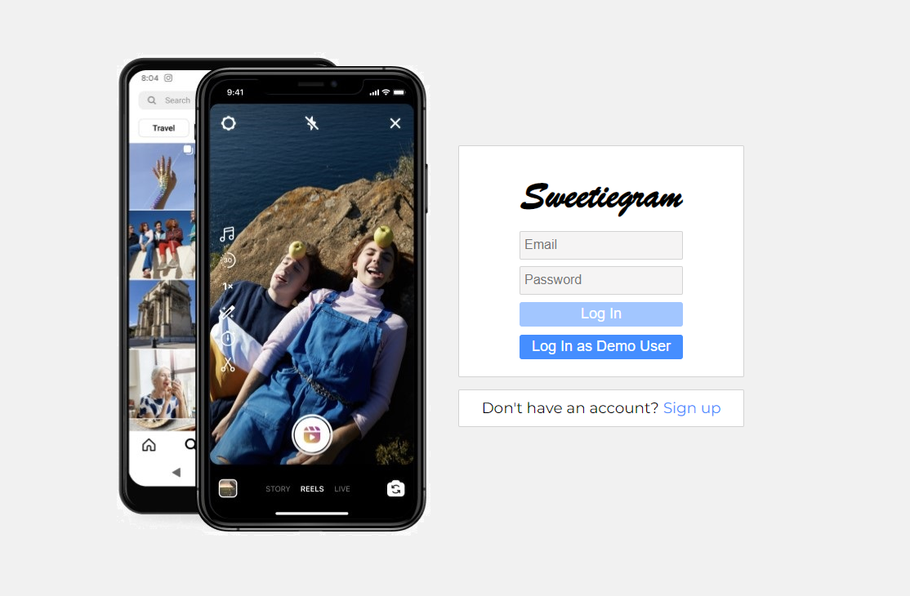
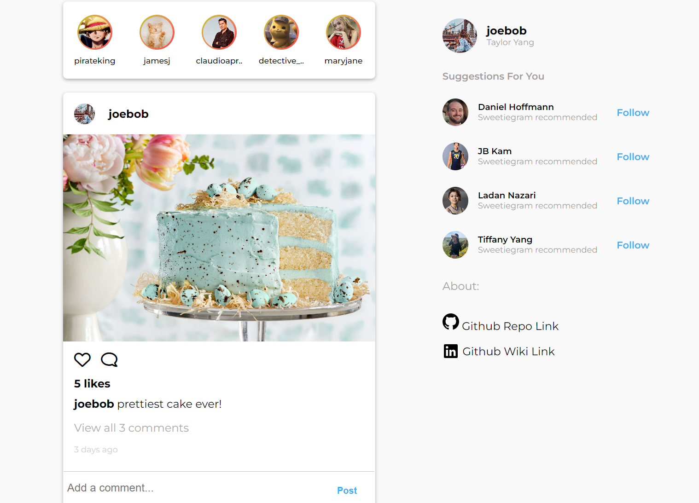
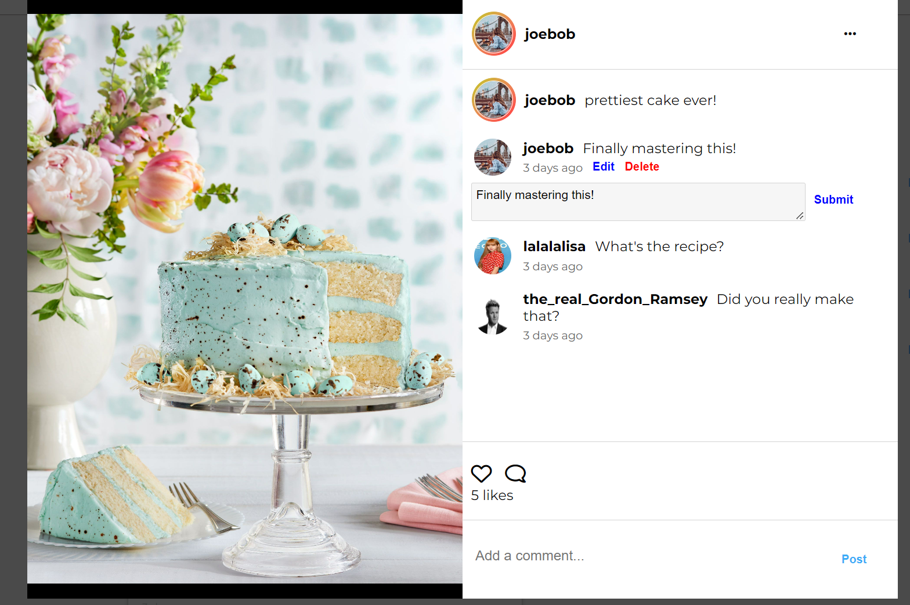
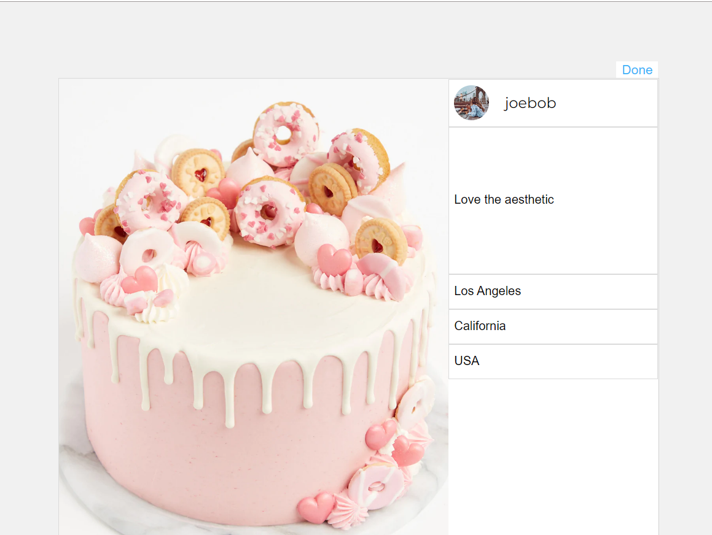
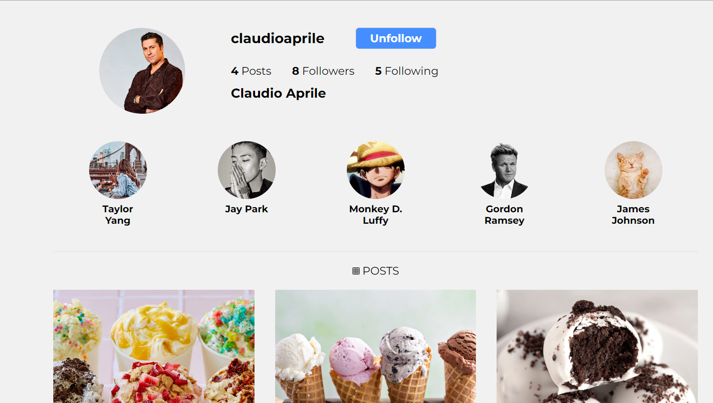
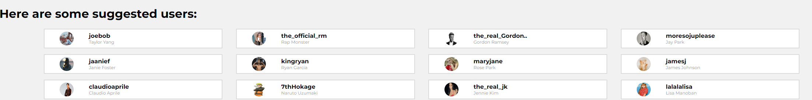

# Sweetiegram -- Instagram Clone

## Purpose of Project

Our group project aims to clone the website Instagram -- a popular social media platform knowing for sharing pictures. It is a full stack project that utilizes the following technologies:

### Backend: Flask, WTForms, Alembic, SQL-Alchemy, SQlite
### Frontend: React, Redux, HTML & CSS

## Instructions for running locally:

1. run ```git clone https://github.com/Pepa90210/Sweetiegram.git``` to have it downloaded to your local repo and run ```code .``` to have it open in vscode
2. Download the necessary packages from package.json in backend by running ```pipenv install -r requirements.txt``` 
3. To download packages in frontend, cd into react-app folder and run ```npm i``` to install all dependencies
4. From root of project directory, run ```pipenv flask run``` or enter virtual environment first with ```pipenv shell``` then ```flask run``` . The backend should now be running on port 5000
5. In another terminal, from react-app subdirectory, run ```npm start``` to run frontend port on 3000.

## Instructions for navigating the website

### Login Page
Login in through Demo User (preferred) or sign in with a new user



### Main Page
Once logged in, you will see the thread of Sweetiegram posts, as well as the contributors' names on the right. This page can be directly accessed from the navbar by clicking the home icon button. For each post, you can directly create a comment in each post, inside the input box displayed, or click on the magnify glass icon to view the post modal.


### Editing Comment
While viewing the post, users can edit and delete their own posts by clicking the 'edit' or 'delete' button. Simple!


### Creating a post
On the Navbar, click the plus button to create your own post and share it. Only your followers can see your post details, while your picture will be public to all.


### Editing a Post
After clicking a post, click the top right button with 3 dots to toggle the edit and delete buttons (for your posts only). Click "edit", and edit your post details. The image itself is not changeable, similar to Instagram.


### Viewing profile page
You can view your own page by clicking the dropdown menu and clicking "profile". You can also view other people's profile pages you're following by clicking the profile links in the middle section of the page.


### Explore page
You can browse through different photos by clicking the compass icon in the navbar. These photos are available to the public, regardless of whom you're following.


### Search page
You can search all users of the platform by clicking the magnifying glass in the navbar. This will be refactored in the near weeks as a proper search engine (for the purposes of emphasizing other features, we chose to prioritize this last). 



## That's all folks!
### Thank you for visiting our website, please feel free to interact with it as much as you like and email tiffanyang2015@gmail.com or any contributors listed for further information. 
